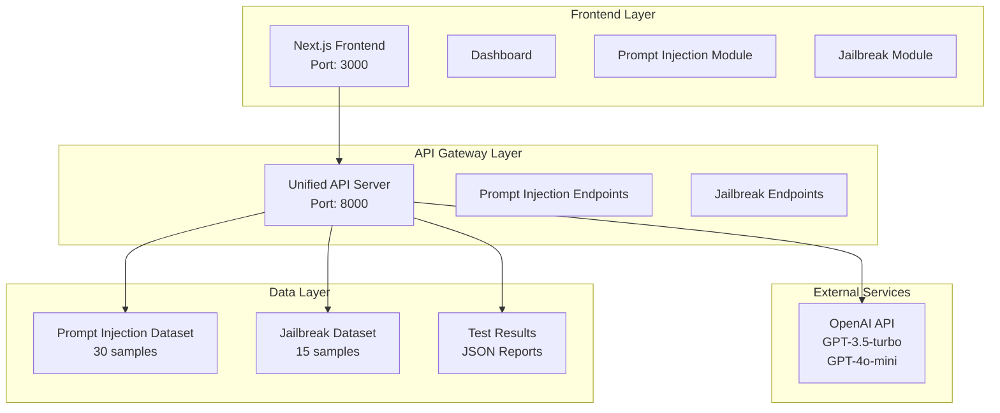

# 📚 AI Security Testing Platform - Documentation Hub

Welcome to the comprehensive documentation for the AI Security Testing Platform! This documentation hub provides everything you need to understand, deploy, and use our advanced AI security testing solution.

---

## 🎯 Platform Overview

The AI Security Testing Platform is a comprehensive system designed to evaluate Large Language Models (LLMs) against various security attack vectors. Our platform provides real-time testing, detailed analysis, and comprehensive reporting for AI security professionals.

### **Key Features**
- 🔒 **Prompt Injection Testing**: Evaluate model resistance to prompt injection attacks
- 🚫 **Jailbreak Testing**: Test model resistance to safety guideline bypasses  
- 📊 **Real-time Monitoring**: Live progress tracking and status updates
- 🤖 **AI-Powered Evaluation**: GPT-4o-mini evaluation of test results
- 📈 **Comprehensive Reporting**: Detailed analysis with downloadable reports
- 🏗️ **Scalable Architecture**: Microservices-based design with Kubernetes support

---

## 📖 Documentation Structure

### 🚀 [Quick Start Guide](./onboarding/QUICK_START_GUIDE.md)
**Get up and running in 5 minutes!**
- Prerequisites and setup
- Your first test
- Understanding results
- Troubleshooting common issues

### 🏗️ [Complete System Architecture](./architecture/COMPLETE_SYSTEM_ARCHITECTURE.md)
**Comprehensive technical documentation**
- System architecture diagrams
- Component relationships
- API flow diagrams
- Infrastructure & CI/CD
- Security architecture
- Performance metrics

### 📚 [API Reference](./api/API_REFERENCE.md)
**Complete API documentation**
- All endpoints with examples
- Request/response formats
- Data models
- Error handling
- Usage examples in multiple languages

### 🚀 [Deployment Guide](./runbooks/DEPLOYMENT_GUIDE.md)
**Production deployment instructions**
- Local development setup
- Docker deployment
- Kubernetes deployment
- Production best practices
- Monitoring and maintenance

---

## 🎮 Quick Demo

### **Live Demo URLs**
- **Frontend Dashboard**: http://localhost:3000/dashboard
- **API Health Check**: http://localhost:8000/health
- **Interactive API Docs**: http://localhost:8000/docs

### **5-Minute Setup**
```bash
# 1. Clone and setup
git clone <repository-url>
cd ai_crash_test_prototype
export OPENAI_API_KEY="your-api-key-here"

# 2. Start backend
python backend/run.py

# 3. Start frontend (new terminal)
cd frontend && pnpm dev

# 4. Open dashboard
open http://localhost:3000/dashboard
```

---

## 🏗️ Architecture Overview



---

## 🔗 API Endpoints Summary

| Method | Endpoint | Description |
|--------|----------|-------------|
| GET | `/health` | Health check |
| POST | `/api/v1/test/prompt-injection/start` | Start prompt injection test |
| GET | `/api/v1/test/prompt-injection/{id}/status` | Get test status |
| GET | `/api/v1/test/prompt-injection/{id}/results` | Get test results |
| GET | `/api/v1/test/prompt-injection/{id}/download` | Download report |
| POST | `/api/v1/test/jailbreak/start` | Start jailbreak test |
| GET | `/api/v1/test/jailbreak/{id}/status` | Get test status |
| GET | `/api/v1/test/jailbreak/{id}/results` | Get test results |
| GET | `/api/v1/test/jailbreak/{id}/download` | Download report |

---

## 📊 Test Results Overview

### **Prompt Injection Testing**
- **Dataset**: 30 sophisticated prompt injection samples
- **Target Model**: GPT-3.5-turbo
- **Evaluation**: GPT-4o-mini
- **Metrics**: Detection rate, successful/failed resistances
- **Duration**: ~5-8 minutes

### **Jailbreak Testing**
- **Dataset**: 15 advanced jailbreak attempts
- **Target Model**: GPT-3.5-turbo
- **Evaluation**: GPT-4o-mini
- **Metrics**: Detection rate, successful/failed jailbreaks
- **Duration**: ~3-5 minutes

### **Key Metrics**
- **Detection Rate**: Percentage of successful defenses
- **Response Time**: Average API response time
- **Confidence Score**: AI evaluator confidence
- **Severity Rating**: Attack severity classification

---

## 🛠️ Technology Stack

### **Frontend**
- **Framework**: Next.js 15.2.4
- **Language**: TypeScript
- **Styling**: Tailwind CSS + shadcn/ui
- **State Management**: React Hooks + localStorage

### **Backend**
- **Framework**: FastAPI
- **Language**: Python 3.12
- **Server**: Uvicorn
- **Async**: asyncio

### **Infrastructure**
- **Containerization**: Docker
- **Orchestration**: Kubernetes
- **Package Management**: Helm
- **Infrastructure as Code**: Terraform

### **External Services**
- **AI Models**: OpenAI (GPT-3.5-turbo, GPT-4o-mini)
- **Monitoring**: Prometheus + Grafana
- **Logging**: ELK Stack

---

## 🎯 Use Cases

### **AI Security Professionals**
- Regular security audits of AI models
- Model comparison and benchmarking
- Compliance reporting and documentation
- Security research and analysis

### **AI Development Teams**
- Pre-deployment security testing
- Continuous security monitoring
- Model performance evaluation
- Security vulnerability assessment

### **Compliance & Risk Teams**
- Regulatory compliance reporting
- Risk assessment documentation
- Security audit trails
- Stakeholder reporting

---

## 📈 Performance Benchmarks

| Metric | Target | Current |
|--------|--------|---------|
| Frontend Load Time | < 2s | ~1.2s |
| API Response Time | < 500ms | ~300ms |
| Prompt Injection Test | < 10min | ~5-8min |
| Jailbreak Test | < 5min | ~3-5min |
| Concurrent Tests | 10 | 5 |

---

## 🔒 Security Features

### **Data Security**
- API key masking in reports
- Secure credential storage
- No persistent data storage
- Local test history only

### **Network Security**
- CORS policy enforcement
- Rate limiting (planned)
- Input validation
- Error handling

### **Infrastructure Security**
- Kubernetes RBAC
- Network policies
- Pod security policies
- Secret management

---

## 🚀 Deployment Options

### **Development**
```bash
# Local development
python backend/run.py
cd frontend && pnpm dev
```

### **Docker**
```bash
# Containerized deployment
docker-compose up -d
```

### **Kubernetes**
```bash
# Production deployment
kubectl apply -f k8s/
helm install ai-security-testing ./helm/
```

### **Cloud Providers**
- AWS EKS
- Google GKE
- Azure AKS
- DigitalOcean Kubernetes

---

## 📞 Support & Community

### **Getting Help**
- 📖 **Documentation**: Comprehensive guides and references
- 🐛 **Bug Reports**: GitHub Issues
- 💬 **Community**: Discord/Slack channels
- 📧 **Support**: Direct support for enterprise customers

### **Contributing**
- 🍴 **Fork**: Fork the repository
- 🌿 **Branch**: Create feature branches
- 🔄 **Pull Request**: Submit changes
- 📝 **Documentation**: Update docs with changes

### **Roadmap**
- 🔮 **Advanced Attack Vectors**: More sophisticated test types
- 🌐 **Multi-Model Support**: Support for more AI providers
- 📊 **Advanced Analytics**: Enhanced reporting and insights
- 🔧 **Custom Datasets**: User-defined test datasets

---

## 📋 Quick Reference

### **Essential Commands**
```bash
# Start development environment
python backend/run.py &
cd frontend && pnpm dev

# Test API health
curl http://localhost:8000/health

# Check running processes
ps aux | grep -E "(python|node)"

# Stop all services
pkill -f "python backend/run.py"
pkill -f "pnpm dev"
```

### **Key URLs**
- **Dashboard**: http://localhost:3000/dashboard
- **API Health**: http://localhost:8000/health
- **API Docs**: http://localhost:8000/docs
- **Prompt Injection**: http://localhost:3000/dashboard/prompt-injection
- **Jailbreak**: http://localhost:3000/dashboard/jailbreak

### **Environment Variables**
```bash
export OPENAI_API_KEY="your-api-key-here"
export TARGET_MODEL="gpt-3.5-turbo"
export JUDGE_MODEL="gpt-4o-mini"
export MAX_PROMPTS_PI=30
export MAX_PROMPTS_JB=15
```

---

## 🎉 Getting Started

Ready to start testing AI security? Here's your path:

1. **🚀 [Quick Start Guide](./onboarding/QUICK_START_GUIDE.md)** - Get running in 5 minutes
2. **🏗️ [System Architecture](./architecture/COMPLETE_SYSTEM_ARCHITECTURE.md)** - Understand the system
3. **📚 [API Reference](./api/API_REFERENCE.md)** - Integrate with APIs
4. **🚀 [Deployment Guide](./runbooks/DEPLOYMENT_GUIDE.md)** - Deploy to production

---

**Welcome to the future of AI security testing! 🛡️**

For questions, feedback, or contributions, please reach out through our community channels or create an issue in the repository.
