# 🏗️ AI Security Testing Platform - Complete System Architecture

## 📋 Table of Contents
1. [System Overview](#system-overview)
2. [Architecture Diagram](#architecture-diagram)
3. [Component Architecture](#component-architecture)
4. [API Flow Diagrams](#api-flow-diagrams)
5. [Data Flow Architecture](#data-flow-architecture)
6. [Infrastructure & CI/CD](#infrastructure--cicd)
7. [Security Architecture](#security-architecture)
8. [Deployment Architecture](#deployment-architecture)

---

## 🎯 System Overview

The AI Security Testing Platform is a comprehensive system designed to evaluate Large Language Models (LLMs) against various security attack vectors. The platform consists of multiple microservices, a modern frontend, and robust infrastructure components.

### **Core Capabilities**
- **Prompt Injection Testing**: Evaluates model resistance to prompt injection attacks
- **Jailbreak Testing**: Tests model resistance to safety guideline bypasses
- **Real-time Monitoring**: Live progress tracking and status updates
- **Comprehensive Reporting**: Detailed analysis with AI-powered evaluation
- **Historical Analysis**: Persistent test history and trend analysis

---

## 🏗️ Architecture Diagram

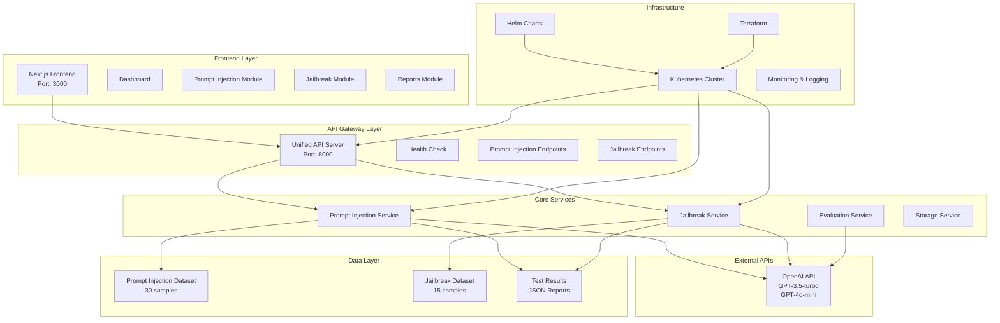

---

## 🔧 Component Architecture

### **Frontend Components**

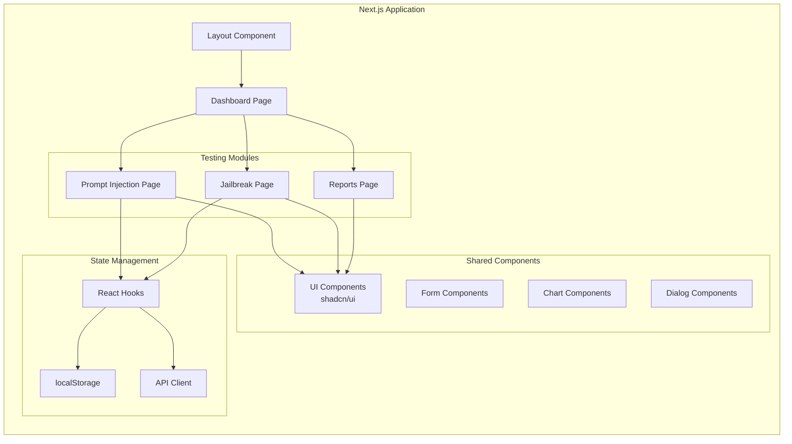

### **Backend Services Architecture**

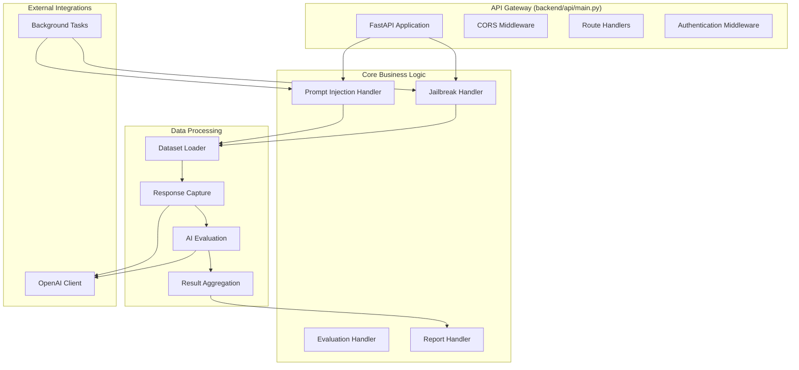

---

## 🔄 API Flow Diagrams

### **Prompt Injection Test Flow**

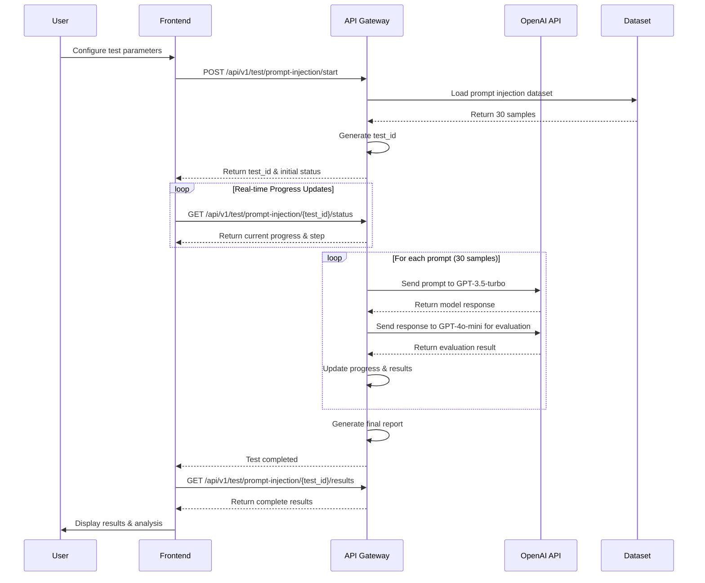

### **Jailbreak Test Flow**

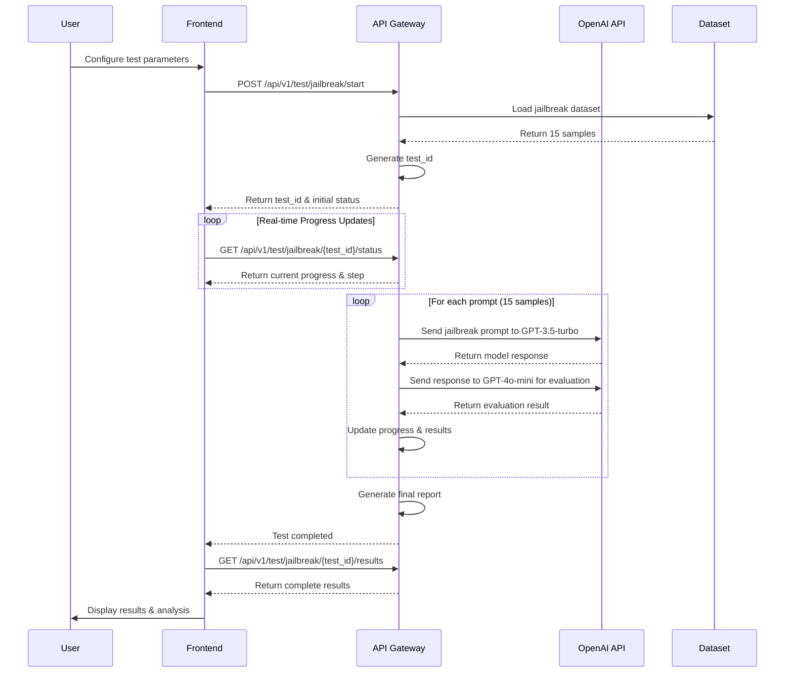

### **Real-time Status Polling Flow**

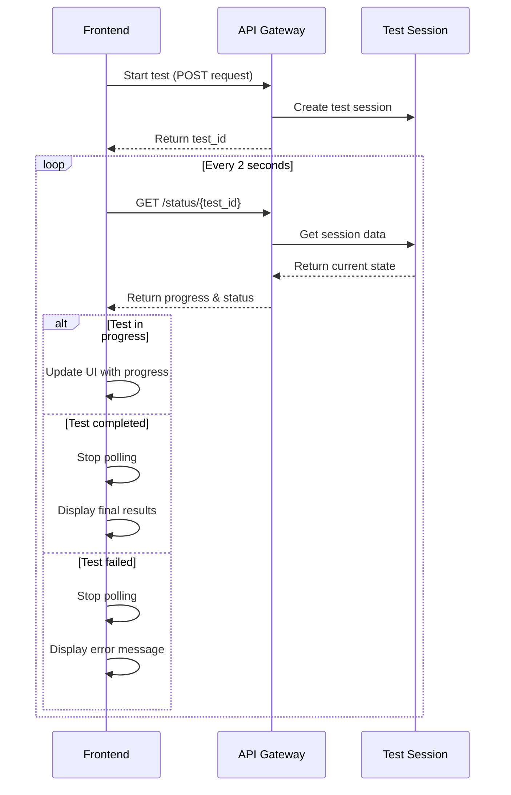

---

## 📊 Data Flow Architecture

### **Data Processing Pipeline**

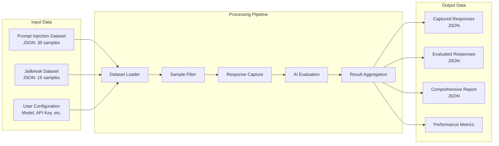

### **Data Storage Architecture**

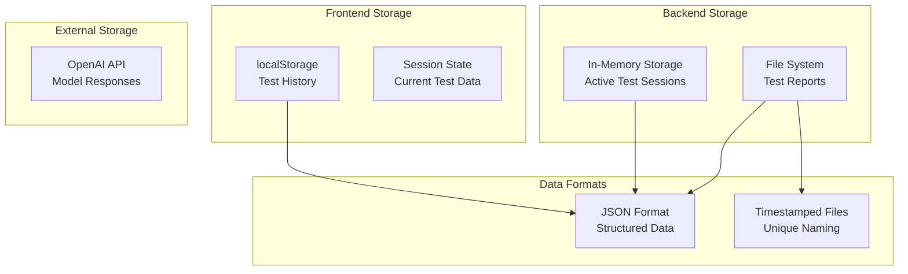

---

## 🚀 Infrastructure & CI/CD

### **Infrastructure Architecture**

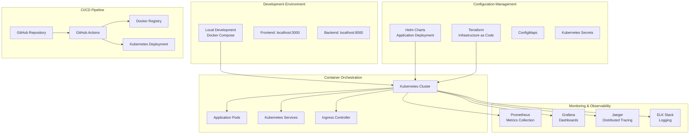

### **CI/CD Pipeline Flow**

```mermaid
graph LR
    subgraph "Source Control"
        CODE[Source Code]
        PR[Pull Request]
        MAIN[Main Branch]
    end
    
    subgraph "CI Pipeline"
        BUILD[Build & Test]
        LINT[Code Linting]
        UNIT_TEST[Unit Tests]
        INTEGRATION_TEST[Integration Tests]
        SECURITY_SCAN[Security Scan]
    end
    
    subgraph "CD Pipeline"
        BUILD_IMAGE[Docker Build]
        PUSH_REGISTRY[Push to Registry]
        DEPLOY_STAGING[Deploy to Staging]
        E2E_TEST[End-to-End Tests]
        DEPLOY_PROD[Deploy to Production]
    end
    
    subgraph "Monitoring"
        HEALTH_CHECK[Health Checks]
        ROLLBACK[Auto Rollback]
        ALERTS[Alerts & Notifications]
    end
    
    CODE --> PR
    PR --> BUILD
    BUILD --> LINT
    LINT --> UNIT_TEST
    UNIT_TEST --> INTEGRATION_TEST
    INTEGRATION_TEST --> SECURITY_SCAN
    SECURITY_SCAN --> BUILD_IMAGE
    BUILD_IMAGE --> PUSH_REGISTRY
    PUSH_REGISTRY --> DEPLOY_STAGING
    DEPLOY_STAGING --> E2E_TEST
    E2E_TEST --> DEPLOY_PROD
    DEPLOY_PROD --> HEALTH_CHECK
    HEALTH_CHECK --> ROLLBACK
    HEALTH_CHECK --> ALERTS
```

---

## 🔒 Security Architecture

### **Security Layers**

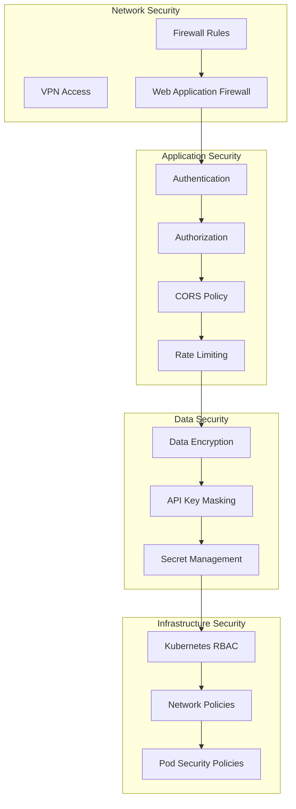

---

## 🚀 Deployment Architecture

### **Production Deployment**

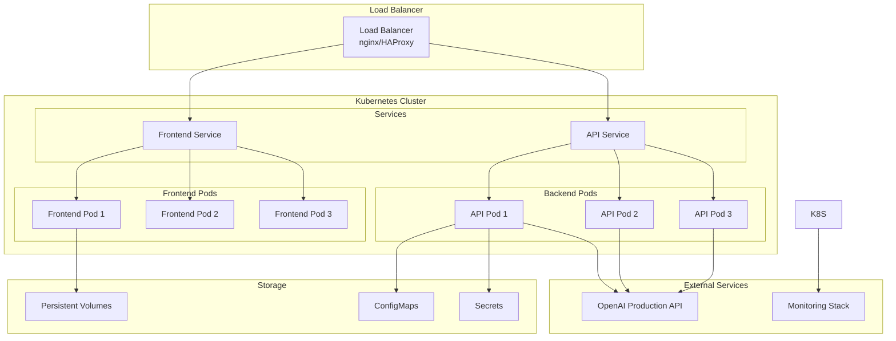

---

## 📈 Performance & Scalability

### **Performance Metrics**

| Component | Metric | Target | Current |
|-----------|--------|--------|---------|
| Frontend | Load Time | < 2s | ~1.2s |
| API Response | Average Latency | < 500ms | ~300ms |
| Test Execution | Prompt Injection (30 samples) | < 10min | ~5-8min |
| Test Execution | Jailbreak (15 samples) | < 5min | ~3-5min |
| Concurrent Tests | Max Concurrent | 10 | 5 |

### **Scalability Architecture**

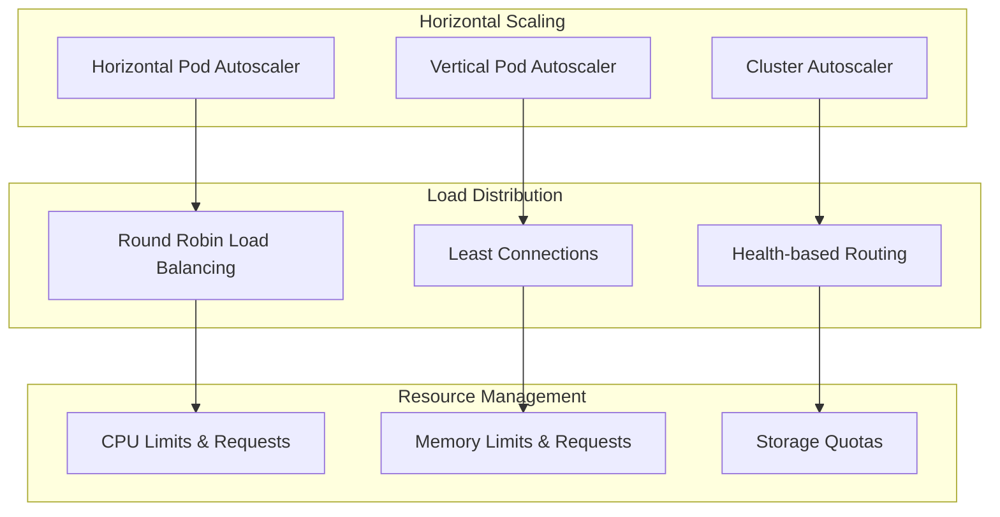

---

## 🔧 Technology Stack

### **Frontend Stack**
- **Framework**: Next.js 15.2.4
- **Language**: TypeScript
- **Styling**: Tailwind CSS
- **UI Components**: shadcn/ui
- **State Management**: React Hooks
- **HTTP Client**: Fetch API

### **Backend Stack**
- **Framework**: FastAPI
- **Language**: Python 3.12
- **Async Runtime**: asyncio
- **HTTP Server**: Uvicorn
- **API Documentation**: OpenAPI/Swagger

### **Infrastructure Stack**
- **Container Orchestration**: Kubernetes
- **Package Management**: Helm
- **Infrastructure as Code**: Terraform
- **Container Registry**: Docker Hub/ECR
- **CI/CD**: GitHub Actions

### **External Services**
- **AI Models**: OpenAI (GPT-3.5-turbo, GPT-4o-mini)
- **Monitoring**: Prometheus + Grafana
- **Logging**: ELK Stack
- **Tracing**: Jaeger

---

## 📋 API Endpoints Summary

### **Core Endpoints**

| Method | Endpoint | Description | Response Time |
|--------|----------|-------------|---------------|
| GET | `/health` | Health check | < 100ms |
| POST | `/api/v1/test/prompt-injection/start` | Start PI test | < 500ms |
| GET | `/api/v1/test/prompt-injection/{id}/status` | Get PI status | < 200ms |
| GET | `/api/v1/test/prompt-injection/{id}/results` | Get PI results | < 300ms |
| GET | `/api/v1/test/prompt-injection/{id}/download` | Download PI report | < 500ms |
| POST | `/api/v1/test/jailbreak/start` | Start jailbreak test | < 500ms |
| GET | `/api/v1/test/jailbreak/{id}/status` | Get jailbreak status | < 200ms |
| GET | `/api/v1/test/jailbreak/{id}/results` | Get jailbreak results | < 300ms |
| GET | `/api/v1/test/jailbreak/{id}/download` | Download jailbreak report | < 500ms |

---

## 🎯 Key Features for Client Demo

### **1. Real-time Testing Experience**
- Live progress tracking with visual indicators
- Real-time status updates every 2 seconds
- Interactive result cards with detailed analysis

### **2. Comprehensive Security Testing**
- 30 prompt injection samples with various techniques
- 15 sophisticated jailbreak attempts
- AI-powered evaluation using GPT-4o-mini

### **3. Professional Reporting**
- Detailed JSON reports with timestamps
- Performance metrics and analysis
- Exportable results for further analysis

### **4. Scalable Architecture**
- Microservices-based design
- Kubernetes-ready deployment
- Horizontal scaling capabilities

### **5. Production-Ready Features**
- Health monitoring and alerting
- Comprehensive logging and tracing
- Security best practices implementation

---

## 🚀 Getting Started

### **Quick Start Commands**

```bash
# Start the unified API server
python backend/run.py

# Start the frontend (in separate terminal)
cd frontend && pnpm dev

# Access the application
# Frontend: http://localhost:3000/dashboard
# API Health: http://localhost:8000/health
# API Docs: http://localhost:8000/docs
```

### **Production Deployment**

```bash
# Deploy with Helm
helm install ai-security-testing ./infra/helm/

# Deploy infrastructure with Terraform
cd infra/terraform && terraform apply

# Monitor deployment
kubectl get pods -n ai-security-testing
```

---

This comprehensive architecture document provides a complete overview of the AI Security Testing Platform, including all components, data flows, API interactions, and infrastructure considerations. The system is designed for scalability, security, and maintainability while providing an excellent user experience for AI security testing.
