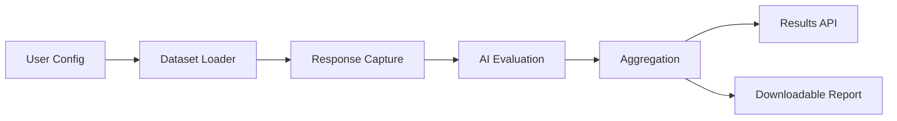

## Welcome to the AI Security Testing Platform

This guide orients new users to what the project is, how it works end-to-end, the system architecture, dependencies, repository structure, core API calls, workflows, and how data flows across the system. It consolidates details from existing docs into one place with links for deeper dives.

### What this project is

An enterprise-grade platform to evaluate Large Language Models (LLMs) against adversarial attacks. It runs automated test suites for:
- Prompt Injection
- Jailbreak attempts
- Data Extraction

You get real-time progress, detailed results, and exportable reports to measure and improve model robustness.

---

## How it functions (End-to-End)

1. A user starts a test from the Next.js dashboard (Prompt Injection / Jailbreak / Data Extraction).
2. The frontend calls the backend API to create a test session.
3. The backend launches a background job that iterates over curated datasets, calls OpenAI models, evaluates responses (optionally with a “judge” model), aggregates metrics, and stores results in memory and JSON reports.
4. The frontend polls status until completion, then fetches full results and displays analytics. Users can download structured JSON reports.

Key properties:
- Stateless test workers, session-scoped in-memory state
- Dataset-driven test execution
- AI-assisted evaluation for security outcomes

---

## System Architecture

At a glance:

```mermaid
graph TB
  subgraph Frontend
    FE[Next.js 15 (TypeScript, Tailwind, shadcn/ui)]
    FE -->|Fetch| API
  end

  subgraph Backend (FastAPI)
    API[API Gateway]
    PI[Prompt Injection Service]
    JB[Jailbreak Service]
    DE[Data Extraction Service]
    EVAL[Evaluation]
  end

  subgraph Data
    D1[Datasets (JSON)]
    R[Results (JSON)]
  end

  subgraph External
    OAI[OpenAI API]
  end

  FE --> API
  API --> PI
  API --> JB
  API --> DE
  PI --> OAI
  JB --> OAI
  DE --> OAI
  EVAL --> OAI
  PI --> D1
  JB --> D1
  DE --> D1
  PI --> R
  JB --> R
  DE --> R
```

For a deeper architectural breakdown (components, flows, infra), see `docs/architecture/COMPLETE_SYSTEM_ARCHITECTURE.md`.

---

## Dependencies

### Frontend
- Next.js 15.2.4
- React 19, React DOM 19
- TypeScript 5+
- Tailwind CSS, shadcn/ui
- Package manager: pnpm (recommended)

### Backend
- Python 3.11+ (tested with 3.12)
- FastAPI, Uvicorn
- Pydantic v2
- OpenAI Python SDK 1.x

### Infrastructure (optional / production)
- Kubernetes, Helm, Terraform
- CI/CD with GitHub Actions

Environment variables:
- Frontend: `NEXT_PUBLIC_API_URL`
- Backend: `OPENAI_API_KEY`, `CORS_ORIGINS`
- Optional tuning: `TARGET_MODEL`, `JUDGE_MODEL`, `MAX_PROMPTS_PI`, `MAX_PROMPTS_JB`, `MAX_PROMPTS_DE`, `LOG_LEVEL`

---

## Repository & Code Structure

High-level layout:

```text
ai_crash_test_prototype/
├─ docs/                      # Product docs, API reference, architecture, runbooks
├─ infra/                     # Terraform, k8s, helm
├─ platform/                  # Shared libs/services (Python)
├─ backend/                   # FastAPI application (API, services, models)
├─ frontend/                  # Next.js app (dashboard)
├─ data/                      # Datasets and helpers
├─ results/                   # Generated JSON reports
├─ tests/                     # Unit/integration/e2e tests
└─ tools/                     # Dev tooling & scripts
```

Backend structure:
```text
backend/
├── api/
│   └── main.py              # FastAPI app entrypoint & routes
├── config/
│   └── settings.py          # Configuration & env
├── models/
│   └── schemas.py           # Pydantic request/response models
├── services/
│   ├── auth.py              # Session & simple auth
│   └── test_executor.py     # Test orchestrators (PI/JB/DE)
└── scripts/                 # Utilities for verification/testing
```

Frontend highlights:
```text
frontend/
├─ app/                      # Route handlers & pages (dashboard, login)
├─ components/               # UI primitives (shadcn/ui)
├─ lib/config.ts             # Centralized API base URL
└─ styles/, tailwind config  # Styling
```

---

## Core API Calls (Summary)

Base URLs:
- Development: `http://localhost:8000`
- Production: set `NEXT_PUBLIC_API_URL` to your deployed backend URL

Health:
- GET `/health`

Auth (simple session auth for demo):
- POST `/api/v1/auth/login`
- POST `/api/v1/auth/logout`
- POST `/api/v1/auth/verify`

Prompt Injection:
- POST `/api/v1/test/prompt-injection/start`
- GET `/api/v1/test/prompt-injection/{test_id}/status`
- GET `/api/v1/test/prompt-injection/{test_id}/results`
- GET `/api/v1/test/prompt-injection/{test_id}/download`

Jailbreak:
- POST `/api/v1/test/jailbreak/start`
- GET `/api/v1/test/jailbreak/{test_id}/status`
- GET `/api/v1/test/jailbreak/{test_id}/results`
- GET `/api/v1/test/jailbreak/{test_id}/download`

Data Extraction:
- POST `/api/v1/test/data-extraction/start`
- GET `/api/v1/test/data-extraction/{test_id}/status`
- GET `/api/v1/test/data-extraction/{test_id}/results`
- GET `/api/v1/test/data-extraction/{test_id}/download`

Detailed examples and schemas are in `docs/api/API_REFERENCE.md`.

---

## Workflows

### Start a Prompt Injection test (frontend)
1. User configures provider/model in dashboard
2. Frontend POSTs to `/api/v1/test/prompt-injection/start`
3. Receives `test_id`, begins polling `/status`
4. On completion, fetches `/results` and displays analytics
5. Optional: Download report via `/download`

### Backend execution lifecycle
1. Initialize session with `test_id`, status, counters
2. Load dataset (e.g., 30 samples), set totals
3. For each sample: send target prompt to model; evaluate via judge model
4. Aggregate metrics & analysis; update progress/status
5. Finalize session and expose results/report endpoints

### Authentication (demo)
- Simple in-memory session tokens from `/api/v1/auth/login`
- `verify` checks validity; `logout` invalidates the token

---

## Data Flow

Pipeline:


Storage & formats:
- Frontend: `localStorage` for test history and session metadata
- Backend: in-memory sessions for active tests, JSON reports emitted to `results/`
- Data formats: structured JSON for captured/evaluated responses and final summaries

Datasets:
- Located under `data/` (e.g., `prompt_injection_*.json`, `jailbreak_*.json`)
- Helpers/scripts available for generating/validating datasets

---

## Local Development

Prerequisites: Python 3.11+, Node.js 18+, an OpenAI API key.

Backend:
```bash
export OPENAI_API_KEY="sk-..."
python backend/run.py
# API: http://localhost:8000   Docs: http://localhost:8000/docs
```

Frontend:
```bash
cd frontend
pnpm install
pnpm dev
# App: http://localhost:3000
```

Configure local API base URL for the frontend (dev):
```bash
# frontend/.env.local
NEXT_PUBLIC_API_URL=http://localhost:8000
```

---

## Deployment Overview

Frontend (Vercel):
- Root directory: `frontend`
- Env: `NEXT_PUBLIC_API_URL` set to your backend URL
- `vercel.json` is preconfigured for Next.js builds

Backend (separate host: Railway/Render/Heroku/DO):
- Install with `pip install -r backend/requirements.txt`
- Start with `python backend/api/main.py` (or uvicorn)
- Set env: `OPENAI_API_KEY`, `CORS_ORIGINS`

Production notes:
- Vercel hosts frontend only; deploy backend separately
- Configure CORS to allow the Vercel domain(s)
- Add monitoring/logging where appropriate (see infra docs)

For step-by-step deployment details, see `DEPLOYMENT_ANALYSIS.md` and `docs/runbooks/DEPLOYMENT_GUIDE.md`.

---

## Security & Compliance (Essentials)

- Never hardcode API keys; use environment variables and secret managers
- Configure CORS precisely; restrict to known origins in production
- Consider JWT-based auth, rate limiting, and audit logs for enterprise usage
- Mask sensitive values in logs/reports (already handled for API keys)

---

## Where to go next

- Architecture deep dive: `docs/architecture/COMPLETE_SYSTEM_ARCHITECTURE.md`
- API details and examples: `docs/api/API_REFERENCE.md`
- Quick start walkthrough: `docs/onboarding/QUICK_START_GUIDE.md`
- Deployment checklist: `DEPLOYMENT_CHECKLIST.md`

If you read only one file after this, open the Architecture deep dive.


